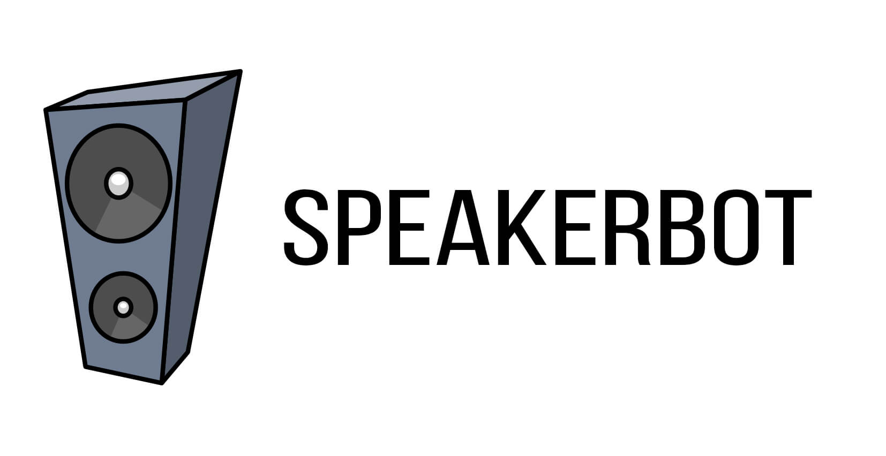

Speakerbot is a multiserver music bot for Discord written in Go. Supports Youtube links and querying Youtube, as well as on the fly converting resulting in instant playback (no wait times between songs!).

## Commands

- `!play` - Queues/Plays Youtube link, or searches Youtube and picks the first result
- `!skip` - Skips current track
- `!stops` - Stops playing and clears queue

## Installation

Speakerbot requires both [`ffmpeg`](https://ffmpeg.org/download.html) and [`opus-tools`](https://www.opus-codec.org/downloads/) to be installed locally and available in PATH. Currently tested with Go 1.6 on OSX.

```bash
go get github.com/dustinblackman/speakerbot
make
make build
```

A configuration file is available to plugin your Discord email and password, as well as a Google API key that can search Youtube. You can either rename the `config.example.json` to `config.json`, or copy/paste the following.

```json
{
  "email": "",
  "password": "",
  "googleKey": ""
}
```

Lastly, start Speakerbot

```bash
./speakerbot
```

## Docker

An automated docker build is available here. You can boot it up with `docker-compose` like so as an example.

```yaml
speakerbot:
  image: dustinblackman/speakerbot
  environment:
    EMAIL:
    PASSWORD:
    GOOGLEKEY:
```

## Contribute/Development

If you wish to contribute and add features to Speakerbot, feel free! This app was just a practice app to begin learning Go, so there won't be very much (or any at all) future development from myself.

Make sure to run `make test` before submitting a PR.

## [License](LICENSE)

MIT
